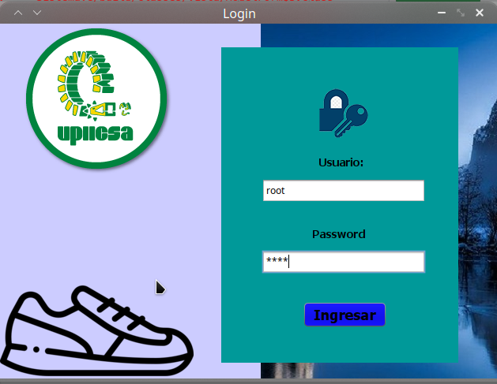
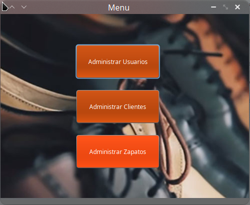
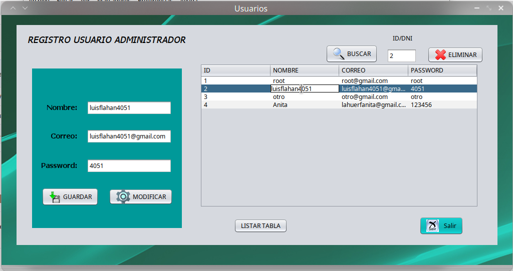
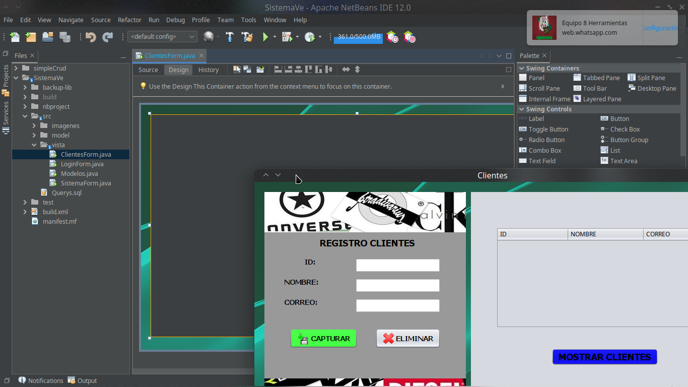
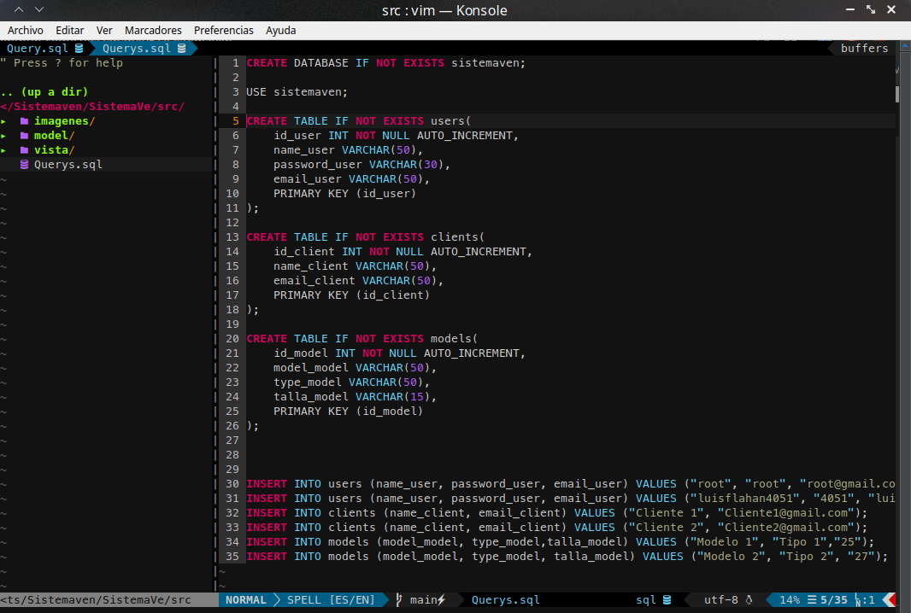

# Sistemaven Simple registradora
**Fork del repositorio original** https://github.com/Brian-54/Sistemaven

Proyecto escolar del instituto:
IPN - UPIICSA

Profesor: 
Miranda Chavez Edna Martha.

## Capturas

## Tecnologías usadas 🛠️

Lenguaje de programación **Java JDK 15**

Interfaz GUI **JSwing**

Base de Datos **MySql**

ID **NetBeans**

### Pre-requisitos de compilación 📋

Java JRE y JDK.

MySql

### Instalación 🔧

**EN EDICIÓN**
**<--Para ejecutar en **windows** y **Linux** hay que alzar el servidor de MySql cambiar las contraseña de conección en Connect.java y ejecutar las consultas de creacion de la BD en Querys.sql**
**luego compilar y abrir el archivo SistemaVe.jar situado en la carpeta Dist**

## Autores ✒️
Secuencia: **1CM12**

**Melendez Bustamante Luis Fernando.**
2020602568
https://github.com/luisflahan4051

**Brian**
--
https://github.com/Brian-54

**et alli**
--
--

## Licencia 📄

Fue contruído bajo OpenJDK en Fedora 32.
